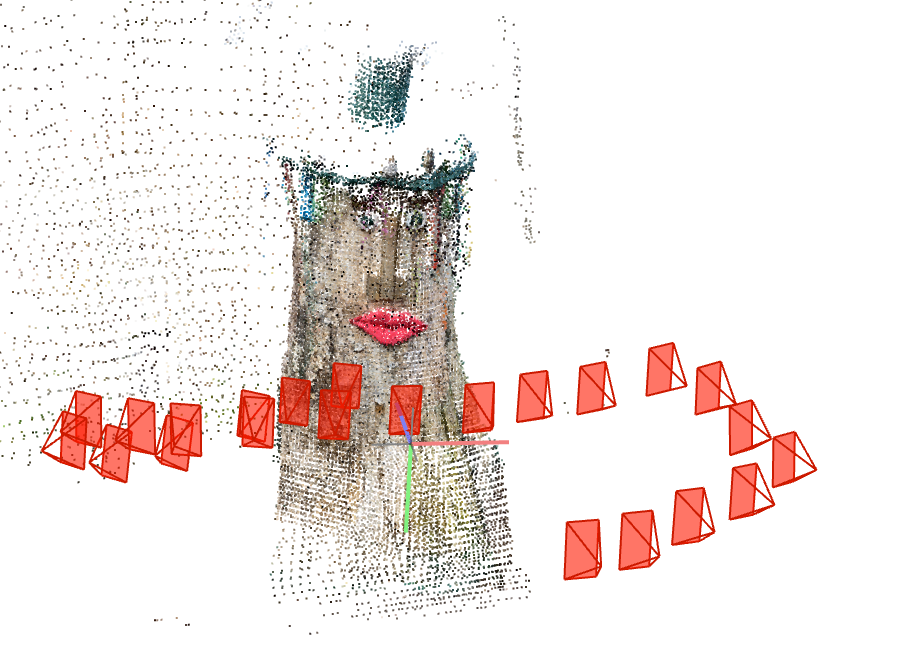
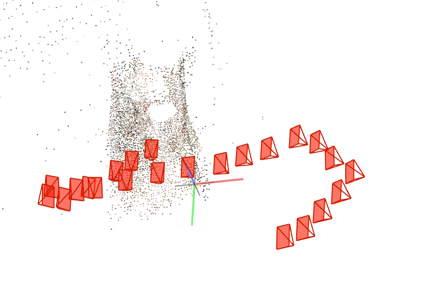
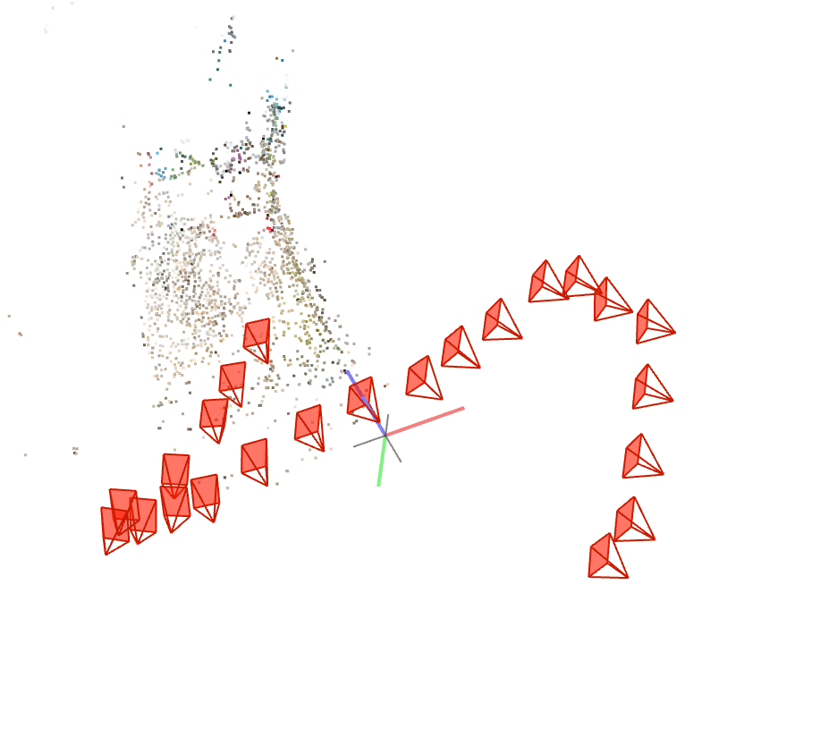

## Example script for using kornia and pycolmap for 3D reconstruction

For the classical local feature pipeline - check [KeyNetAffNetHardNet pipeline](keynetaffnet-adalam-pycolmap-3dreconstruction.ipynb) and [DISK pipeline](DISK-adalam-pycolmap-3dreconstruction.ipynb)

For the LoFTR (a bit hacky) pipeline - check [LoFTR](loftr-pycolmap-3dreconstruction.ipynb)

### LoFTR 640px reconstruction

### DISK-2k reconstruction

### KeyNetAffNetHardNet-2k reconstruction

The repo is based on [kornia-adalam](https://kornia-tutorials.readthedocs.io/en/latest/image_matching_adalam.html) tutorial, with help of DISK [h5py-to-colmap](https://github.com/cvlab-epfl/disk/tree/master/colmap) scripts.

